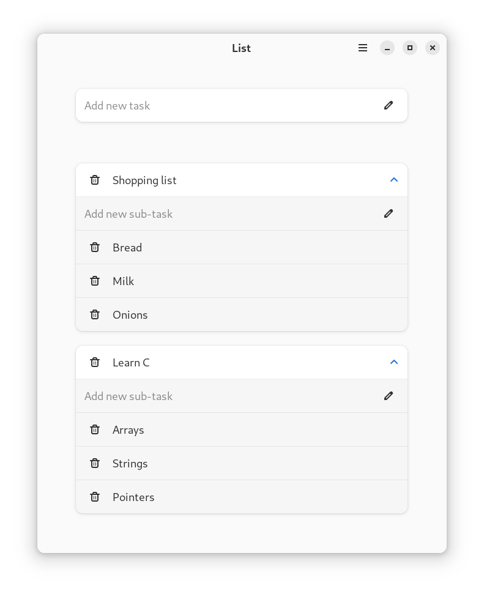
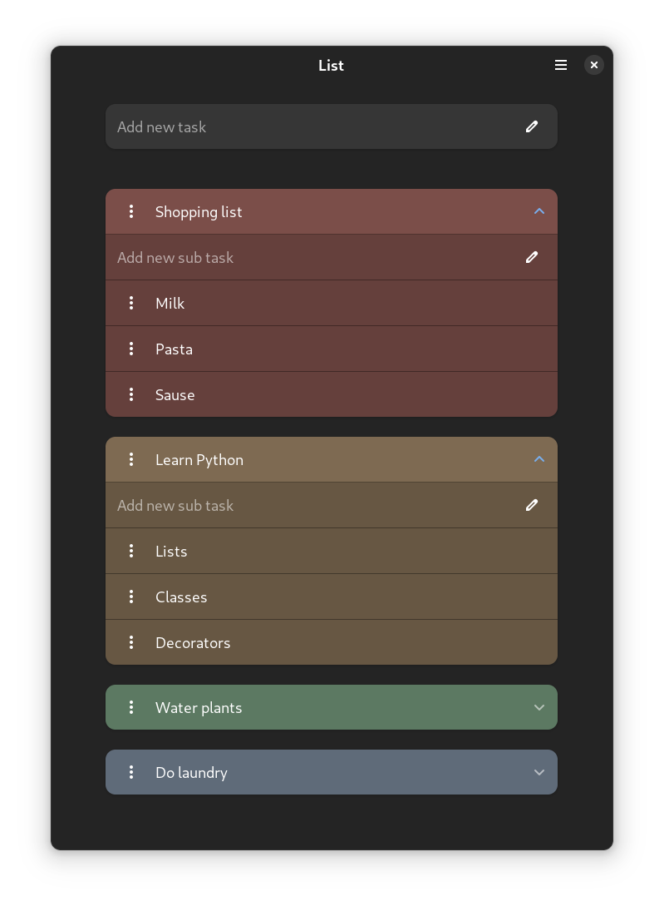

# List

Focus on your tasks.
Todo application for those who prefer simplicity. Add new todo's, remove comleted, nothing more.

## Screenshots

## Installing
List is available as a Flatpak on Flathub:

## Building from source
1. Clone repo `git clone https://github.com/mrvladus/List`
2. Install dependencies: 
  - Fedora 37 and later: `libadwaita-devel flatpak-builder`
  - Debian 12 / Ubuntu 22.10 and later`libadwaita-1-dev flatpak-builder`
4. Run `make run`
