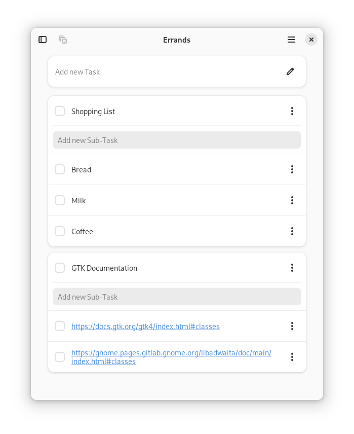

  

  # Errands

  Manage your tasks
  
  
  
  
  

  

## Features
- Add, remove, edit, complete tasks and sub-tasks
- Sync tasks with Nextcloud or other CalDAV providers
- Multiple task lists support
- Add accent color for each task
- Drag and Drop support
- Customizable UI

## Sync
Errands is using [python-caldav](https://github.com/python-caldav/caldav) library for syncing with Nextcloud Tasks and other CalDAV providers.

For now, only **Nextcloud** is supported and known to work well.
Other providers **may not work**. See [python-caldav  documentation](https://caldav.readthedocs.io/en/latest/#compatibility) for more info on compatibility.

## Install
### Flatpak
Errands is available as a Flatpak on Flathub:

It's the **only** supported verion.

### Build flatpak using GNOME Builder
1. Install [GNOME Builder](https://flathub.org/apps/org.gnome.Builder).
2. Click "Clone Repository" with `https://github.com/mrvladus/Errands.git` as the URL.
3. Click on the build button at the top.

## Contribute

### Report a bug
- Make sure you are using latest version from [flathub](https://flathub.org/apps/details/io.github.mrvladus.List).
- See the log file at `~/.var/app/io.github.mrvladus.List/data/errands/log.txt` if it has any errors.
- If there is no errors in log file, then launch app from terminal with `flatpak run io.github.mrvladus.List` and copy the output.
- Create new issue.
- Add steps to reproduce the bug if needed.

### Translate
To translate **Errands** to your language see **[TRANSLATIONS.md](TRANSLATIONS.md)**

### Package
The only officially supported format is **flatpak** on [Flathub](https://flathub.org/apps/details/io.github.mrvladus.List)!
Please, **do not package** it in other formats, but if you do, these are dependencies:
- `libadwaita >= 1.4`
- `libsecret`
- `gtksourceview5`
- `PyGObject`
- `python3-caldav`
- `gnome-online-accounts (optional)`

### Donate
If you like this app, you can support its development. See **[DONATIONS.md](DONATIONS.md)**

## Code of conduct

Errands follows the GNOME project [Code of Conduct](https://wiki.gnome.org/Foundation/CodeOfConduct).
