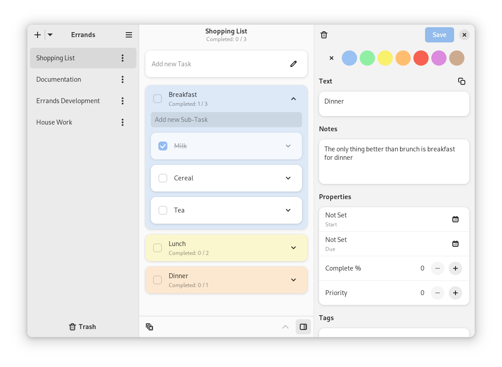

  

  # Errands

  Manage your tasks

  

  
  

## Features
- Add, remove, edit tasks and sub-tasks
- Mark task and sub-tasks as completed
- Add accent color for each task
- Drag and Drop support

## Install
Errands is available as a Flatpak on Flathub:

## Building using GNOME Builder
1. Install [GNOME Builder](https://flathub.org/apps/org.gnome.Builder).
2. Click "Clone Repository" with `https://github.com/mrvladus/List.git` as the URL.
3. Click on the build button at the top.

## Contribute

### Translations
To translate Errands to your language you can use <a href="https://flathub.org/ru/apps/net.poedit.Poedit">Poedit</a>
1. Fork and clone repo.
2. Open Poedit.
- Open `po/errands.pot` file.
- Select your language and start translation. Remember to add your name and email in settings.
- Save it in `po` directory. Turn off compilation to `.mo` files on save in settings. We dont need those.
- Add your language in `po/LINGUAS` file separated by new line.
3. Test if you translation works by running `./build-aux/run-flatpak.sh`.
5. Commit your changes and open a pull request.
6. Watch for updates in the future to provide additional translations.

## Code of conduct

Errands follows the GNOME project [Code of Conduct](https://wiki.gnome.org/Foundation/CodeOfConduct).
